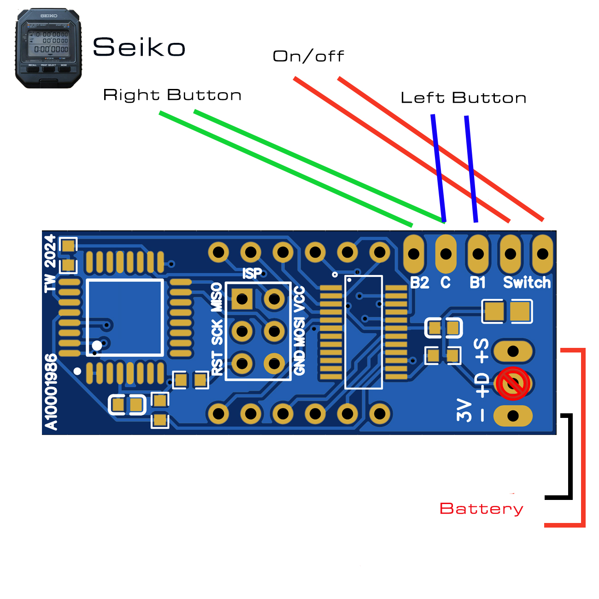
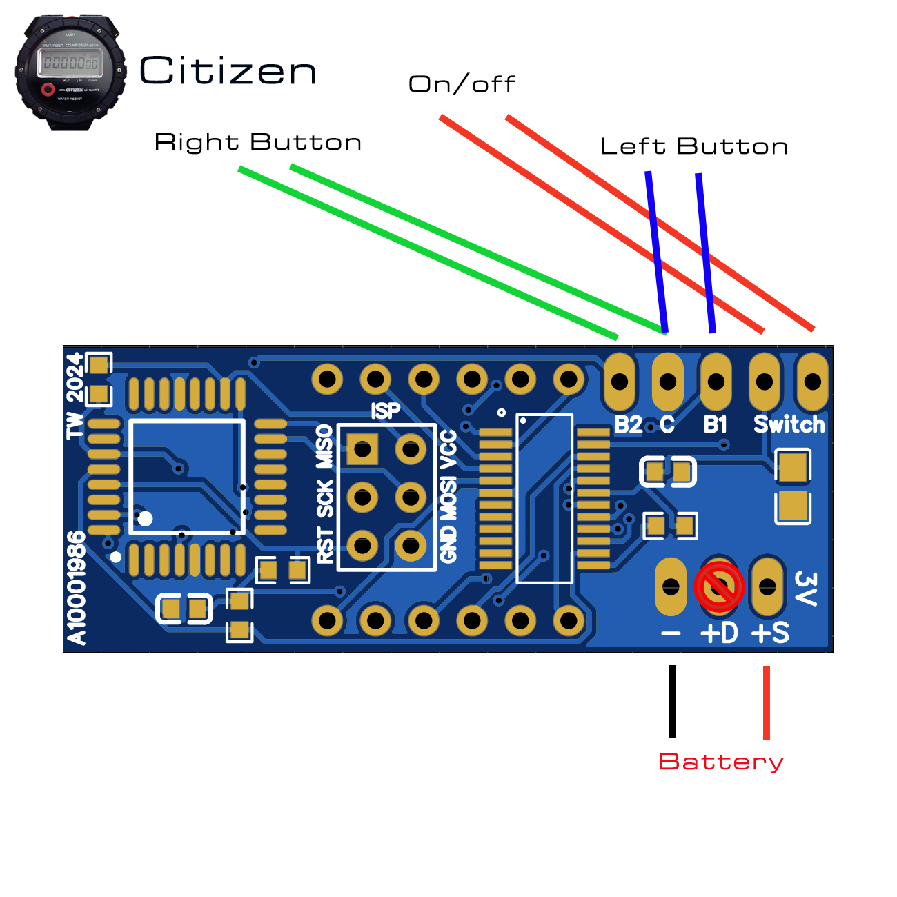

There are two PCBs: Seiko and Citizen. They are identical feature-wise, the only difference is the PCB layout. The replicas planned back in 2024 required different layouts due to battery placement.

Power supply: 3V. Rechargable CR123A battery recommended. One charge lasts about 5 hours, depending on use. 

