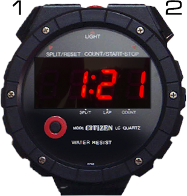

# Doc's Stopwatches

This repository holds the electronics production files and the firmware for movie-adapted Citizen(tm) or Seiko(tm) stopwatches (or replicas thereof), as used by Doc Emmett Brown in the very first scene introducing time travel.

At some point, complete replicas might become available [here](https://movieprops.blog/shop/). You can, however, make your own eletronics using the files in the Eletronics folder.

## Instructions

Buttons can be pressed or held; "holding" means pressing and holding a button for 2 seconds or more.

(Repeatedly) holding button 1 selects the mode:

### Movie mode:

In this mode, the watch starts at 1:18 and runs until 1:22, after which it restarts at 1:18.

Pressing button 1 resets the time to 1:18. Pressing button 2 advances the minute by 1.

The seconds are movie-accurate and therefore shorter than real seconds, by about 1/12. The dots are movie-accurate as well and their blinking is therefore slightly offset to minute changes.

### Stopwatch mode:

Button 1: Reset / lap

Button 2: Start/stop

### Counter mode:

Button 1: Reset to 0.

Button 2: Advance by 1.

### Clock mode:

Holding button 2 enters Set Mode:
- Button 2 advances hour by 1.
- Holding button 2 switches to minute setup.
- Button 2 advances minutes by 1.
- Button 1 advances minutes by 10.
- Holding button 2 exists Set mode.

## Settings

Hold button 1 while powering up to enter settings.

### Calibration

Please note that this is a movie prop after all. It is not a real chronograph. Timing will vary with voltage, temperature and precision of the internal timer. 

You can calibrate it to be a bit more precise:

By default, 1000 is displayed. If your watch runs fast, increase the value shown by pressing button 2. If it runs slow, decrease by pressing button 1.

The range is from 980 to 1020. The value means the amount of milliseconds of the internal timer to be considered one real second.

Holding button 2 saves the chosen value and proceeds to Screen Saver setup, holding button 1 exits Settings without saving.

### Screen Saver

In order to save power, the watch supports a screen saver in Movie Mode. The Screen Saver disables the display after 20 minutes without user interaction.

"SS 0" means the Screen Saver is off, "SS 1" means it is on. Press either button to toggle the value.

Holding button 2 saves the chosen value and exits Settings. Holding button 1 exits Settings without saving the Screen Saver setup.

## Firmware update

In order to update the firmware, you need an ISP programmer, for instance an USBasp. The programmer must be set to 3.3V.

The firmware requires the "Minicore" package.

Settings in Arduino IDE:
- Board type: Minicore / ATmega328
- Clock: Internal 8Mhz
- BOD: 1.8V or disabled - does not matter when powered through rechargeable Lithium batteries)
- EEPROM retained
- Compiler LTO: Enabled
- Variant: 328PB
- Bootloader: No bootloader

Fresh boards first need their fuses set correctly. In order to do that, you need to call "Burn bootloader" from the "Tools" menu once (yes, despite no bootloader to be installed). This needs to be done in slow mode: In case of the USBasp, set "Programmer" -> "USBasp slow" in the "Tools" menu for that initial step. Updating the firmware can later be done in normal mode ("Programmer" -> "USBasp").

